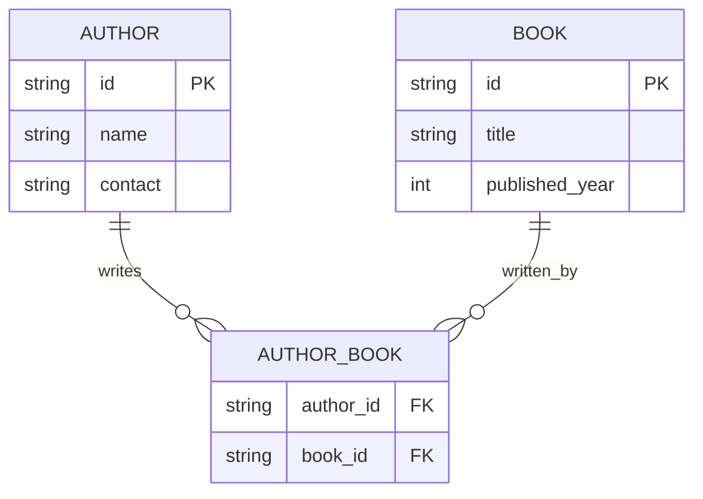

<p align="center">
  <a href="http://nestjs.com/" target="blank"></a>
</p>

# Library API

This is a Library API built using the [Nest](https://github.com/nestjs/nest) framework. It provides endpoints to manage authors and books, including creating, updating, retrieving, and deleting records.

## Table of Contents

- [Description](#description)
- [Installation](#installation)
- [Running the app](#running-the-app)
- [API Endpoints](#api-endpoints)
- [Test](#test)
- [Support](#support)
- [Stay in touch](#stay-in-touch)
- [License](#license)

## Description

The Library API allows you to manage a collection of authors and books. It includes features such as:

- Creating, updating, retrieving, and deleting authors.
- Creating, updating, retrieving, and deleting books.
- Managing relationships between authors and books.

## ERD

Here's the Entity-Relationship Diagram for the Library API:



This ERD illustrates the relationships between the entities in our Library API:

1. **AUTHOR**: Represents the authors in our system.
   - `id`: Unique identifier for each author (Primary Key)
   - `name`: Name of the author
   - `contact`: Contact information for the author

2. **BOOK**: Represents the books in our system.
   - `id`: Unique identifier for each book (Primary Key)
   - `title`: Title of the book
   - `published_year`: Year the book was published

3. **AUTHOR_BOOK**: Represents the many-to-many relationship between authors and books.
   - `author_id`: Foreign Key referencing the AUTHOR table
   - `book_id`: Foreign Key referencing the BOOK table

This design allows for:
- An author to write multiple books
- A book to be written by multiple authors
- Efficient querying of the relationships between authors and books

## Installation

To install the necessary dependencies, run:

```bash
$ npm install
```

## Running the app

To start the application, use one of the following commands:

```bash
# development
$ npm run start

# watch mode
$ npm run start:dev

# production mode
$ npm run start:prod
```

## API Endpoints

### Authors

- **Get all authors**
  ```http
  GET /authors
  ```

- **Get an author by ID**
  ```http
  GET /authors/:id
  ```

- **Create a new author**
  ```http
  POST /authors/create
  ```

- **Update an author by ID**
  ```http
  PUT /authors/:id
  ```

- **Delete an author by ID**
  ```http
  DELETE /authors/delete/:id
  ```

### Books

- **Get all books**
  ```http
  GET /books
  ```

- **Get a book by ID**
  ```http
  GET /books/:id
  ```

- **Create a new book**
  ```http
  POST /books/create
  ```

- **Update a book by ID**
  ```http
  PUT /books/:id
  ```

- **Delete a book by ID**
  ```http
  DELETE /books/delete/:id
  ```

## Test

To run the tests, use the following commands:

```bash
# unit tests
$ npm run test

# e2e tests
$ npm run test:e2e

# test coverage
$ npm run test:cov
```

## Support

Nest is an MIT-licensed open source project. It can grow thanks to the sponsors and support by the amazing backers. If you'd like to join them, please [read more here](https://docs.nestjs.com/support).

## Stay in touch

- Author - [Kamil Myśliwiec](https://kamilmysliwiec.com)
- Website - [https://nestjs.com](https://nestjs.com/)
- Twitter - [@nestframework](https://twitter.com/nestframework)

## License

Nest is [MIT licensed](LICENSE).